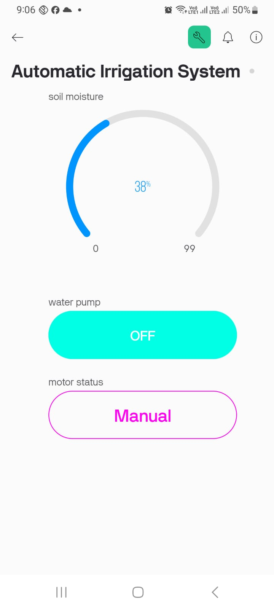
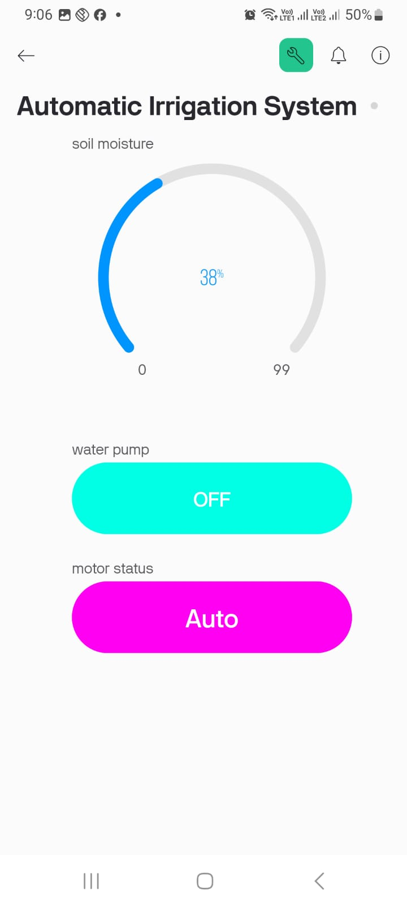

# 🌱 Smart Irrigation System using NodeMCU and Blynk IoT App

This project automates the watering of plants using a soil moisture sensor and controls a water pump based on the moisture level of the soil. The system can be operated in both **Auto Mode** and **Manual Mode** using the **Blynk IoT App**. The core hardware includes a **NodeMCU ESP8266** microcontroller, and the software is developed and uploaded using **Arduino IDE**.

---

## Features

- **Soil Moisture Monitoring**
- **Automatic Pump Control** based on moisture level
- **Manual ON/OFF Control** from Blynk IoT app
- Real-time data sent to Blynk Dashboard
- Modes: Auto Mode & Manual Mode

---

## Hardware Used

| Component          | Quantity |
|--------------------|----------|
| NodeMCU ESP8266    | 1        |
| Soil Moisture Sensor | 1      |
| Relay Module       | 1        |
| Water Pump         | 1        |
| Jumper Wires       | Several  |
| Breadboard         | 1        |
| Power Supply       | 1        |


---
### 🖼️ Hardware Setup
> *Add photos or diagrams of your hardware connections here*

- 


---

## Setup Instructions

### 1. Arduino IDE

- Install [Arduino IDE](https://www.arduino.cc/en/software)
- Install **ESP8266 Board Package**
  - Go to *Preferences* → Paste this into *Additional Board Manager URLs*:  
    `http://arduino.esp8266.com/stable/package_esp8266com_index.json`
  - Then go to *Boards Manager* → search for **ESP8266** → install

### 2. Blynk IoT App

- Download Blynk App (Android / iOS)
- Create a new template (use `TMPL3F-iFpduH`)
- Add the following widgets:
  - **Gauge (V0)** → Soil Moisture %
  - **Button (V1)** → Manual ON/OFF for Water Pump
- Set up **auto mode** by allowing soil sensor to trigger pump when dry (using `V0` values)
- Copy the **auth token** and replace in code

---

### 3. Connections

| NodeMCU Pin | Component |
|-------------|-----------|
| A0          | Soil Moisture Sensor Analog Output |
| D3          | Relay IN pin (for pump control)    |
| VIN/GND     | Power to Sensor & Relay            |

---

## 📷 Project Preview

### 🔧 Blynk App Interface
> *Add screenshots of your Blynk app setup here*

| Auto Mode Toggle | Manual Mode Button |
|------------------|--------------------|
|  |  |

---

## Arduino Code

The code was written and uploaded to the NodeMCU using **Arduino IDE**.

### Libraries Required

- Blynk
- ESP8266WiFi
- BlynkSimpleEsp8266

### Arduino Code Snippet
```cpp
#define BLYNK_TEMPLATE_ID "TMPL3F-iFpduH"
#define BLYNK_TEMPLATE_NAME "Smart Irrigation System"

#define BLYNK_PRINT Serial
#include <ESP8266WiFi.h>
#include <BlynkSimpleEsp8266.h>

char auth[] = "kyACDurbVGByKTC_By7-ZodRcrgZ_PCn";
char ssid[] = "don't ask me";
char pass[] = "123456789";

BlynkTimer timer;
bool Relay = 0;

#define sensor A0
#define waterPump D3

void setup() {
  Serial.begin(9600);
  pinMode(waterPump, OUTPUT);
  digitalWrite(waterPump, HIGH);

  Blynk.begin(auth, ssid, pass, "blynk.cloud", 80);

  timer.setInterval(100L, soilMoistureSensor);
}

BLYNK_WRITE(V1) {
  Relay = param.asInt();

  if (Relay == 1) {
    digitalWrite(waterPump, LOW);
  } else {
    digitalWrite(waterPump, HIGH);
  }
}
void soilMoistureSensor() {
  int value = analogRead(sensor);
  value = map(value, 0, 1024, 0, 100);
  value = (value - 100) * -1;

  Blynk.virtualWrite(V0, value);
}

void loop() {
  Blynk.run();
  timer.run();
}